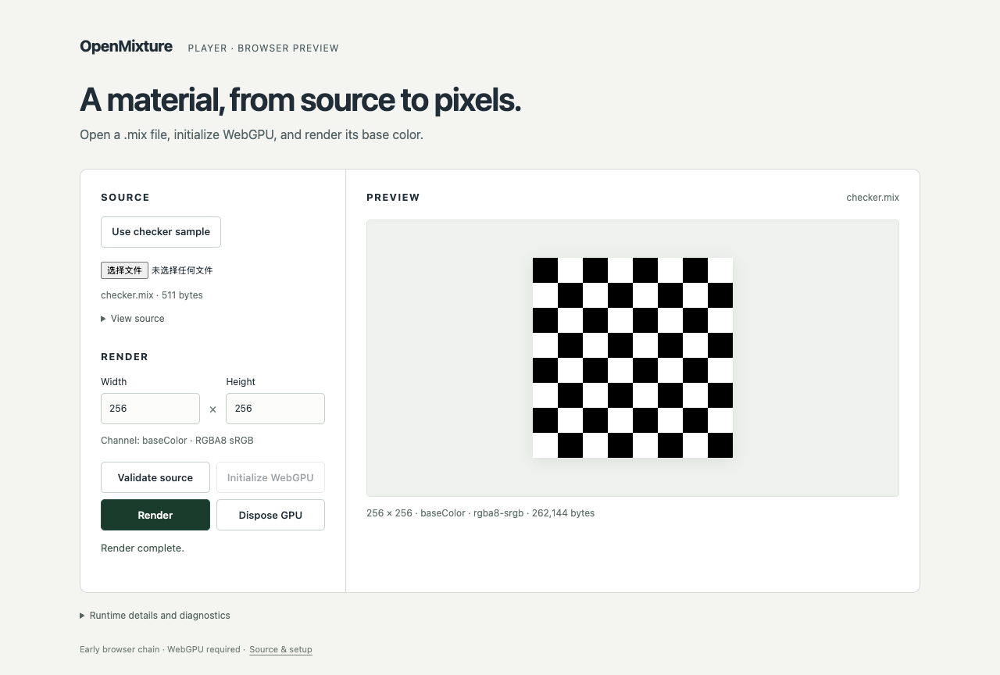

# Initial browser chain — 2026-09-12

English | [简体中文](./README.zh-CN.md)

**Passed: six real Chromium browser tests from a clean independent product checkout.** This records the initial M5-01/M5-02/M5-03 chain, not full M5 acceptance. The consumer installed only the committed npm archive; neither Rust nor an engine checkout is part of its install/build/test commands.

The tested product commit is [`6139c9141e67db1c9d01396e477a5b604791ec56`](https://github.com/OpenMixture/Studio/commit/6139c9141e67db1c9d01396e477a5b604791ec56). The later commit retaining this record is not the tested commit. The archive was produced from clean engine commit [`4b914feb9f3365d292b27ea60c5e0b6004f745e8`](https://github.com/OpenMixture/OpenMixture/commit/4b914feb9f3365d292b27ea60c5e0b6004f745e8). [Build provenance](../../../vendor/runtime-build.json) and [summary.json](./summary.json) bind the archive SHA-256, source/lock identities, fixture, environment and retained files. The archive itself remains in `vendor/`; it has not been published to npm.

## Recorded checks

On macOS 26.5.1 (25F80), Darwin 25.5.0, arm64, with Node 24.20.0, npm 11.19.0 and Chromium 153.0.8010.12, the clean consumer ran these commands at 08:30:44–08:31:02 UTC on 2026-09-12. Every command exited zero; browser results were six passed, zero failed and zero skipped.

```bash
npm ci
npm run check
npm run test:browser
```

The browser used `channel: chromium`, headless execution and the explicit flags `--enable-unsafe-webgpu` and `--ignore-gpu-blocklist`. Assets were served under `/player/`. See [checks](./checks.json), [test outcomes](./browser-results.json) and the [actual runtime context](./runtime-context.json).

| Gate | Observed result |
|---|---|
| Import and CPU boundary | Import does not fetch WASM; validation/catalog/inspection work with GPU access prohibited. Raw duplicate keys, numeric tokens, invalid UTF-8 and request checks stay in the public contract. |
| Package loading | Default package-relative URL, explicit WASM URL and caller-supplied bytes work under `/player/`; missing WASM is a structured failure. |
| Pixels and ownership | All 780 returned RGBA8 bytes for the unchanged 65 × 3 baseColor checker match the independent expected bytes, including after later renders and destruction. Padded mapped data is 2,304 bytes; tracked live bytes after the call are zero. |
| Native semantics | Browser and [native CLI plan](./native-plan.json) hashes match exactly: `sha256:9995360fbeec3cc3cb4d78b7a660eef4ed0e630f1816161454dc80c9b58c0585`. [Native provenance](./native-plan-provenance.json) records its separate clean source and command. |
| Lifecycle | Concurrent render is rejected as busy; in-flight disposal settles; disposed calls fail and owned outputs remain valid. |
| Product interaction | User file bytes validate/render into actual canvas pixels; explicit disposal preserves preview. The synthetic persisted `pagehide` regression verifies real `GPUDevice.destroy`, restored initialization controls and a new successful render. It does not establish real bfcache admission. |

## Preview and evidence limits

The normal production bundle, which excludes the contract harness, rendered the checker at 256 × 256. The [screenshot record](./screenshot.json) binds source/build, time, flags and plan. The agent inspected the image for the visible checker, controls and layout; no user material or visual acceptance is asserted.



The browser reports `BrowserWebGpu` but redacts adapter name, vendor/device and driver details. No hardware model is inferred. The acquisition context's `unverified` verdict remains the original acquisition report; the subsequent successful render is recorded separately. This is one host/browser configuration with explicit flags, not a browser support matrix or a production support promise.

Three-material/browser device-loss qualification, full Player controls/export/scheduling and Studio editing remain open. Website hosting and npm publication were not part of this checkpoint. The screenshot, package, fixture, compact results and required context remain in Git. Complete stdout/stderr and the full Playwright report are ordinary ignored local outputs, so this record does not promise permanent access to every original log. Reproduction creates a new run.
