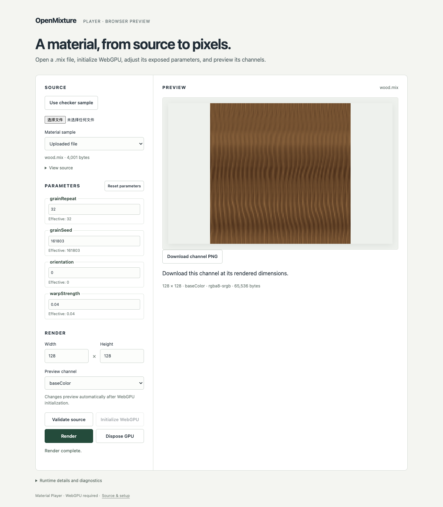

# M5-04 Player export acceptance — 2026-09-15

English | [简体中文](./README.zh-CN.md)

**Passed: the bounded M5-04 Player workflow, 28 Chromium checks and nine Node tests.** The clean tested product commit is `c4fba3f3ca77d465ee1039768d404af063c1f71b`; subsequent evidence commits are not the tested source. [Summary](./summary.json) binds source/input hashes, unchanged runtime archive identity and retained content. M5-05 remains open.

[Isolated execution](./isolation.json) used macOS arm64, Node 24.20.0/npm 11.19.0 and Chromium 153.0.8010.12 at `/player/`, with `--enable-unsafe-webgpu` and `--ignore-gpu-blocklist`. Both original checkouts were denied by the macOS sandbox and Rust was absent from the child PATH. Installation, `npm run check` and `npm run test:browser` exited zero. [Context](./runtime-context.json) records actual browser/device information; redacted adapter fields do not establish a hardware identity.

| Gate | Observed result |
|---|---|
| Three-material workflow | Uploaded ceramic, leather and wood; changed a public parameter; previewed and downloaded baseColor, normal, roughness and height at 128 × 128. All 12 decoded PNGs matched independently invoked public-runtime bytes exactly. |
| Encoding | PNG CRCs, zlib stream, dimensions and raw RGBA samples verified outside the browser. Color files contain sRGB intent 0/gAMA 45455; data files contain gAMA 100000 and no sRGB/profile. Canvas cleared before each download; results still match runtime pixels. Nine Node tests include every byte/alpha value and mutation during compression. |
| Freshness and failure | Rapid edits, invalid input/overrides and real device loss preserve stale previews but disable download. Delayed compression cannot download after an edit or page exit. Compression failure leaves a visible error and retry enabled. |
| Channels and lifecycle | All eight channels download at 65 × 3. Current pixels remain downloadable after explicit GPU disposal. Late file/device completions and bounded render scheduling still pass. |
| UI | Agent inspected retained desktop material screenshots and the 390px export screenshot; download controls are visible. Long source basenames are sanitized/truncated and export messages wrap on narrow screens. |

All [28 browser results](./browser-results.json) are retained. Material measurements include each PNG digest, raw pixel digest and metadata: [ceramic](./glazed-ceramic-preview.json), [leather](./leather-preview.json), [wood](./wood-preview.json). The 12 downloaded files are retained alongside those measurements using `<material>-<channel>.png`; [summary](./summary.json) lists their hashes and byte sizes. These are product export evidence, not replacement engine goldens.

[Leather](./leather-preview.png) · [Ceramic](./glazed-ceramic-preview.png) · [Narrow-screen export](./export-mobile.png)

Reproduce through the [export guide](../../player-export.md) and [isolated recipe](../../m5-02-03.md). This acceptance covers product bytes/metadata and bounded workflows on the recorded browser. It does not establish native/browser 1K quality tolerances, a formal browser CI matrix, broad hardware/browser compatibility, spontaneous device failure handling, deployment or publication. Those remain M5-05 or later gates. Full transient command logs and Playwright traces are not retained in Git; the selected content and identities above are. PR/main CI is distinct from this local clean-source receipt.
