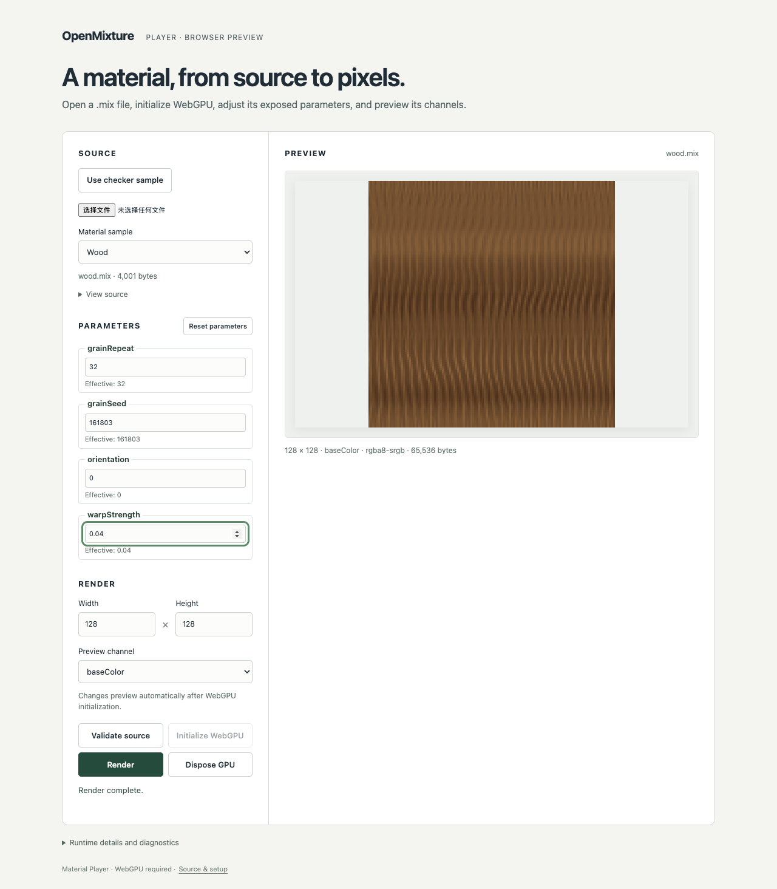

# M5-04 parameters and previews — 2026-09-14

English | [简体中文](./README.zh-CN.md)

**Passed: the parameter/preview slice, with 23 Chromium checks and six Node scheduler/snapshot tests.** Clean tested product commit: `ec7a98ac6e14f9d34eaa9606e32cff6ff0fced92`. The later evidence commit is not the tested source. [Summary](./summary.json) binds the unchanged runtime archive, source/fixture/lock hashes and retained content. Full M5-04 export acceptance remains open.

The [isolated run](./isolation.json) used macOS arm64, Node 24.20.0 / npm 11.19.0 and Chromium 153.0.8010.12 at `/player/`, with `--enable-unsafe-webgpu` and `--ignore-gpu-blocklist`. macOS sandbox denied reads of both original checkouts; Rust was absent from child PATH. Installation, `npm run check` and `npm run test:browser` all exited zero. The [runtime context](./runtime-context.json) records actual limits and redacted adapter fields; no hardware identity is inferred.

| Gate | Observed result |
|---|---|
| Public parameters | Integer/float and color/enum controls use validated Rust metadata. Effective values update after validation; reset restores source/default values. User source bytes remain unchanged. |
| Real material previews | Glazed ceramic, leather and wood each change a public parameter and display baseColor, normal, roughness and height at 128 × 128. All twelve channel images exactly match an independent public-runtime invocation in the same browser. Each changed baseColor differs from its initial image; reset restores it. |
| Latest requests | Six Node tests cover 1000 replacements, old/duplicate completion, invalidation, latest failure, shutdown and immutable snapshots. The real browser [freshness check](./freshness.json) executes initial/held/latest renders, drops the intermediate edit and preserves the last displayed image when a newer override is invalid. |
| Failures and shutdown | Invalid new files clear old bindings. Actual device loss keeps a visibly stale preview. Late file reads cannot replace newer input. Repeated pagehide during a delayed real acquisition waits for destruction of the late device. No alternate executor is used. |
| Layout and ownership | Agent-inspected desktop and 390px screenshots show parameter values and material previews without horizontal overflow. Preview scaling is display-only. Runtime and shader sources, native goldens and the vendor archive are unchanged. |

[Test outcomes](./browser-results.json) retain all 23 browser results. Per-material measurements: [ceramic](./glazed-ceramic-preview.json), [leather](./leather-preview.json), [wood](./wood-preview.json). Reproduce using the [parameter guide](../../player-parameters.md) and [isolation recipe](../../m5-02-03.md).

The following actual production-test screenshots were visually inspected by the agent; this is a product UI review, not human acceptance of new golden pixels:

[Glazed ceramic](./glazed-ceramic-preview.png) · [Leather](./leather-preview.png) · [390px wood layout](./wood-mobile.png)

PNG export/metadata verification, complete M5-04 workflow acceptance, M5-05 1K native/browser quality and formal browser CI remain open. Controlled device destruction and test-only promise barriers do not certify spontaneous hardware failure. Full temporary logs/raw Playwright reports are not retained in Git; critical outcomes, input identities and screenshots are. Reproduction creates a new run. Publishing and website deployment are not included. PR/main CI results are separate from this source-bound local receipt.
