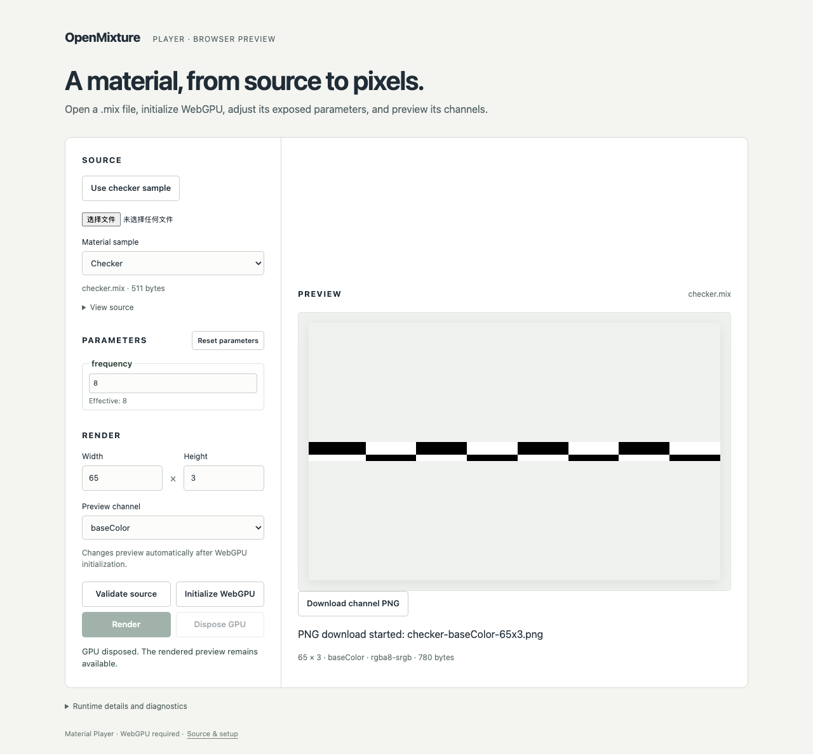

# M5-05 产品验证——2026-09-15

[English](./README.md) | 简体中文

干净产品源码 `56c510ab57daa1b68ef660525a648a582730a37e` 通过隔离安装／检查（九项 Node 测试）、[28 项浏览器检查](./browser-results.json)、[正常生产部署](./deployment.json)及[材质／生命周期执行](./materials.json)。[隔离回执](./isolation.json)证明两个原始检出均禁止读取，PATH 中无 Rust；独立原生清单复制到检出之外。[摘要](./summary.json)绑定保留字节。后续证据提交不是已测代码。

1K 运行覆盖 11 个材质用例，以及对三种默认材质追加四轮生命周期（12 次渲染），每轮保留一个 4 MiB 通道直到后续渲染及设备销毁后。描述符存活字节报告为零，流水线条目不超过九个。浏览器材质 PNG 比较和最终容差验收由引擎 M5-05 记录负责，本执行回执不替代该结论。

代理检查了下面的正常生产截图。该部署中测试契约页面返回 404；实际 WASM 以正确 MIME 加载，并在真实 WebGPU 执行后下载棋盘格 PNG。这是本地静态部署，不是公开托管。运行时归档及引擎像素语义均未变化。

[产品 CI](https://github.com/OpenMixture/Studio/actions/runs/34941131954)在 Ubuntu 24.04 上通过类型／构建任务及真实 Chromium WebGPU 契约／部署任务，使用 Playwright 锁定 Chromium 和显式 SwiftShader 参数。本地确切 Chromium／OS／参数在回执中。该环境及描述符计数不认证广泛硬件兼容性或物理显存回收。CI 完整日志会过期，选定本地内容保留于 Git。通过[验收指南](../../browser-qualification.zh-CN.md)复现。Registry 发布、公开托管及 Studio 编辑仍属独立工作。
