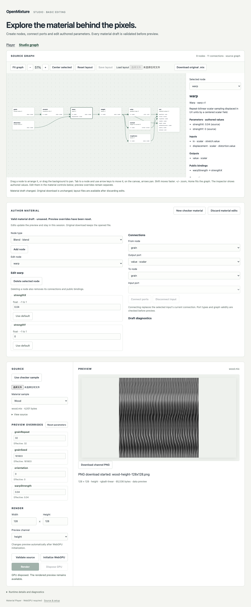

# Studio 基础编辑验证——2026-09-16

[English](./README.md) | 简体中文

干净源码 `01326af3dbdb71536130182671b4a9db2001ce78` **通过本地隔离验收**：安装、公开类型／构建、18 项 Node 测试、44 项真实 Chromium 用例及正常生产部署。[隔离回执](./isolation.json)禁止读取两个原始检出，并从 PATH 移除 Rust。后续纯证据提交不是已测实现。[摘要](./summary.json)绑定源码／包／锁身份及保留文件。

未变更的 `@openmixture/runtime@0.1.0-alpha.0` 在 macOS Darwin 25.5.0 arm64、Node 24.20.0、npm 11.19.0、Playwright 1.63.0 和 Chromium 153.0.8010.12 上运行，使用 `--enable-unsafe-webgpu` 和 `--ignore-gpu-blocklist`。测量中的运行时上下文报告 BrowserWebGpu；适配器名称／驱动被隐藏，不推断硬件身份。

## 结果

- [44 项浏览器用例](./browser-results.json)通过。新增九项编辑用例覆盖删除／重建／连接／断开、原子绑定清理、整数／浮点／枚举／颜色编辑、不完整字段保留、Rust 环／类型诊断及修复、丢弃／替换／新模板行为、真实设备丢失和材质预览。CPU 测试另使用实际打包 Rust 验证器覆盖缺失端点、重复标识、无效值及原始输入拒绝。
- [新鲜度](./authored-freshness.json)记录四次真实 GPU 映射：中间待处理编辑被替换，不完整草稿阻止旧的飞行中渲染替换最新图像或启用 PNG 导出。测试延迟真实映射 Promise，不伪造像素，也不声称 GPU 取消。
- [陶瓷](./glazed-ceramic-editing.json)、[皮革](./leather-editing.json)和[木材](./wood-editing.json)各有四个 128 × 128 通道，独立运行时／画布／解码 PNG 像素摘要一致。确切生成的[陶瓷](./glazed-ceramic-edited.mix)、[皮革](./leather-edited.mix)和[木材](./wood-edited.mix)字节已保留。这些是测试生成的产品样例派生输入，不是新原生 golden 或 STUDIO-05 跨消费者验收。
- [正常部署](./deployment.json)验证两个静态生产入口、真实 WASM MIME、测试页面缺席、编辑后的棋盘格输出及未变的原文件下载。这是本地静态部署，不是公网托管。
- 代理已检查保留的木材编辑器截图。编辑后原文件下载仍逐字节一致。编辑后材质下载、撤销／重做、绑定创作和新原生 1K 比较不属于本切片。

[编辑指南](../../studio-editing.zh-CN.md)记录源传输契约、会话草稿、布局限制及复现命令。普通日志／完整 trace 保持临时状态。远端 PR／CI 检查和集成按最终提交单独报告；此记录仅建立本地隔离验收。
