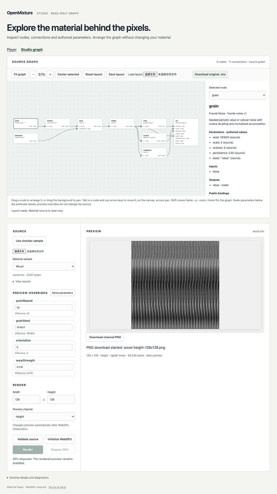

# Studio read-only graph verification — 2026-09-16

English | [简体中文](./README.zh-CN.md)

**Local isolated acceptance passed** for clean product source `de4d18d`: 12 Node tests, public type checks/production build, 35 real Chromium browser cases and normal deployment of Player and Studio. [Isolation](./isolation.json) records the full source revision and successful commands with both original checkouts denied and Rust absent from PATH. Later evidence-only commits are not the tested implementation. [Summary](./summary.json) binds the retained files, package/lock identity and environment.

The unchanged `@openmixture/runtime@0.1.0-alpha.0` archive ran on macOS Darwin 25.5.0 arm64 with Node 24.20.0, npm 11.19.0, Playwright 1.63.0 and Chromium 153.0.8010.12, using `--enable-unsafe-webgpu` and `--ignore-gpu-blocklist`. [Runtime context](./wood-context.json) records BrowserWebGpu limits and adapter fields; the adapter name/driver are redacted, so no hardware identity is inferred. No new registry/public hosting or broader hardware/browser qualification is claimed.

## Observed results

- [35 browser cases](./browser-results.json) passed, including seven Studio cases. Four source graphs can be inspected without GPU acquisition. Valid disconnected nodes, exact numeric text, catalog details and Rust rejection of malformed raw input are covered.
- Keyboard movement, dragging, pan/zoom, independent sidecar loading/saving, mismatched/malformed layouts, unsaved-layout cancellation, late reads and narrow-screen page overflow checks passed. Original downloads remain byte-identical. A 390px viewport check does not qualify a mobile browser/GPU.
- For [ceramic](./glazed-ceramic-measurements.json), [leather](./leather-measurements.json) and [wood](./wood-measurements.json), all four 128 × 128 channels have matching independent-runtime, canvas and decoded PNG pixel digests. These consumer checks do not replace M5's native/browser 1K comparison.
- [Normal static deployment](./deployment.json) loaded both production entries and real WASM with the correct MIME, rendered/downloaded checker output, downloaded exact original source and verified that the test harness returned 404. This is local static deployment, not a public website release.
- The agent inspected the retained wood and narrow-view screenshots. Source editing, authored serialization, undo/redo, bindings editing and STUDIO-05 cross-consumer authoring qualification remain future work.

[Narrow viewport](./studio-narrow.png) · [Normal production entry](./deployment.png)

Reproduce using the [graph guide](../../studio-graph.md) and [isolation recipe](../../m5-02-03.md). Ordinary logs/full traces remain temporary; retained receipts and measurements describe this run. Remote PR/CI integration is reported separately and must be checked for the final commit.
